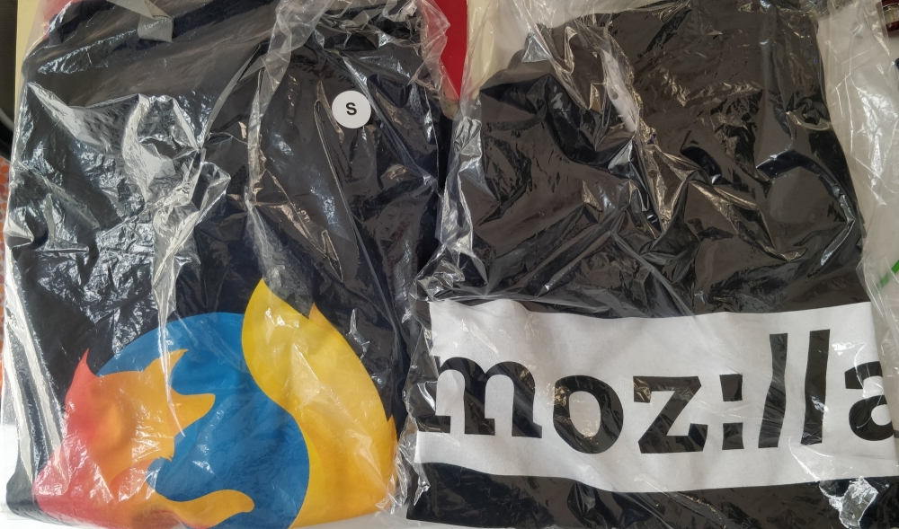
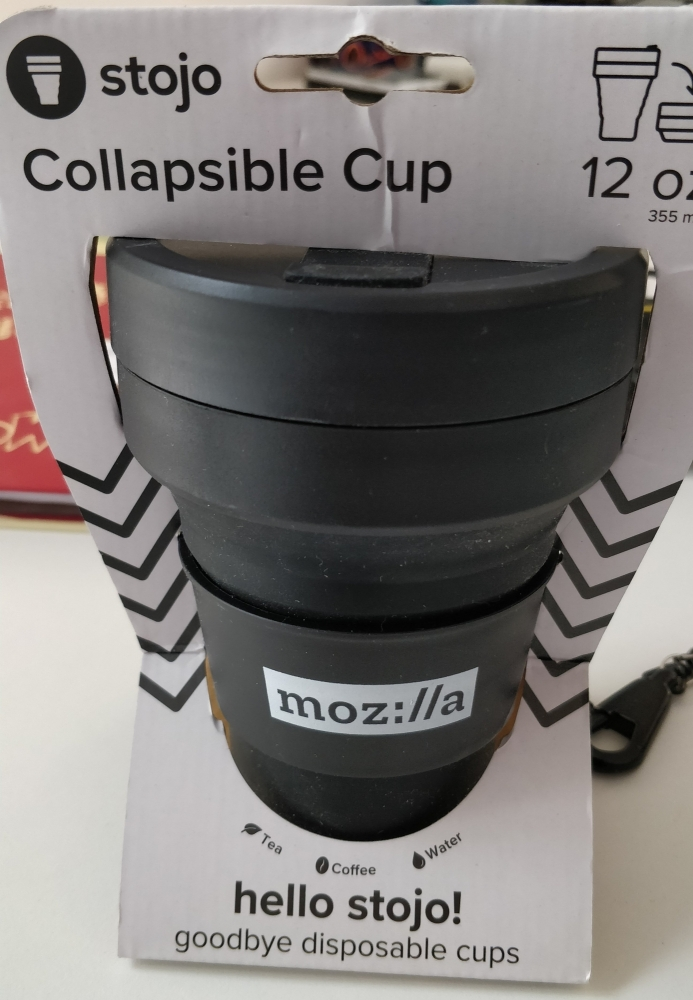
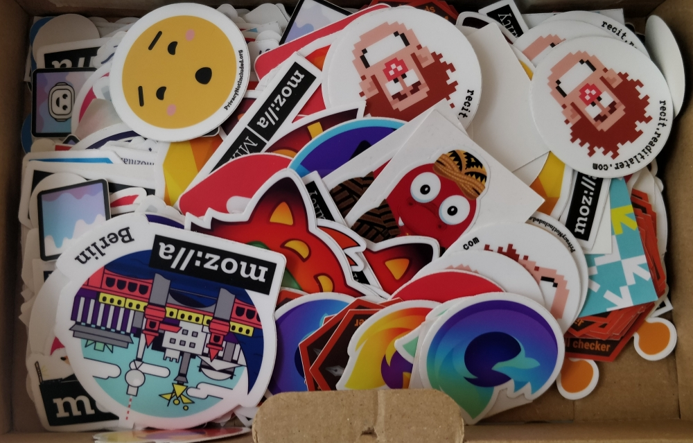
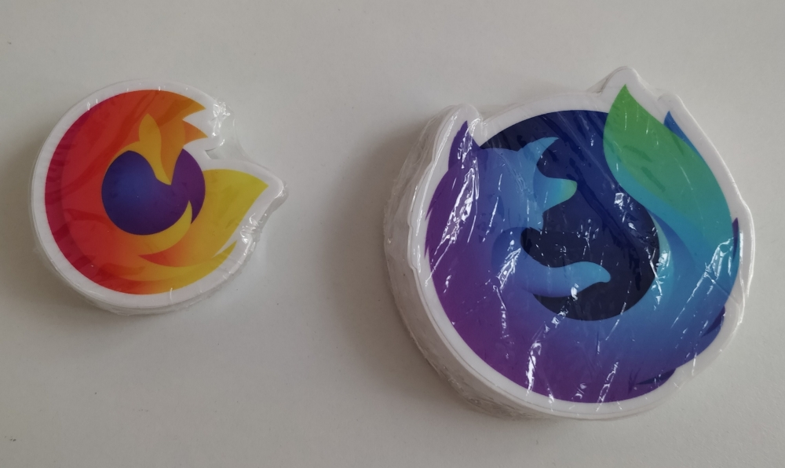

# DeepSpeech-Contest 2020

Developer contest 2020 per progetti open source che utilizzano il [modello di lingua italiana](https://github.com/MozillaItalia/DeepSpeech-Italian-Model).  
Il contest è organizzato dalla comunità Mozilla Italia, costituita da volontari che si occupano di tradurre, promuovere, fare supporto e molto altro per i progetti Mozilla.  
Per questo il contest è informale ovvero, senza certificati di partecipazione (non siamo un entità legale) ma solo tanta voglia di collaborare e divertirsi utilizzando tecnologie open source per invogliare a partecipare nelle attività della comunità.

## Cos'è DeepSpeech e Common Voice

[DeepSpeech o DS](https://github.com/mozilla/DeepSpeech) è il progetto di Mozilla che sfruttando dei dataset genera un modello di riconoscimento vocale. La nostra comunità si occupa di realizzare gli script e di rilasciare il modello di lingua italiana.  
Per tale progetto utilizziamo dataset di pubblico dominio o che la licenza ci permette di aggregarli in modo tale da non permettere la creazione del materiale originali evitando complicazioni legali, essendo il nostro progetto rilasciato a sua volta open source.

[Common Voice o CV](https://commonvoice.mozilla.org/it) è il progetto di Mozilla per la raccolta di registrazioni vocali (scaricabili) di pubblico dominio, la nostra comunità organizza sprint mensili online per arricchire il materiale oltre che fare promozione.  

## Il modello di lingua Italiana

La storia del modello è disponibile in inglese come [articolo](https://daniele.tech/2019/12/how-the-italian-deepspeech-model-helped-our-mozilla-italia-community/) o [presentazione al Fosdem 2020](https://archive.fosdem.org/2020/schedule/event/how_to_get_fun_with_teamwork/) oppure in [italiano in versione breve](https://www.miamammausalinux.org/2020/04/mozilla-italia-promuove-il-modello-di-riconoscimento-vocale-in-italiano-per-deepspeech/).

## Regolamento

* Periodo: 6 ottobre/15 novembre
* Partner
  * Il subreddit https://www.reddit.com/r/italyinformatica sarà partner del contest:
     * Il subreddit sarà utilizzato per le discussioni riguardo il progetto, status per settimana ecc
* Giuria
  * Mozilla Reps Italiani: @Mte90, @edovio, @Sav22999 @astrastefania  
  * Repo modello mantainer: @mone27, @nefastosaturo
  * Moderatori di /r/italyinformatica
* Criteri di valutazione
  * I singoli progetti verranno valutati per il loro funzionamento, replicabilità e secondo il parere/gusto della giuria
* Scopo
  * Realizzare dei progetti che sfruttino il [modello italiano DeepSpeech](https://github.com/MozillaItalia/DeepSpeech-Italian-Model) nelle varie versioni rilasciate 
  * Tali progetti devono essere rilasciati come open source (tecnologie libere) su GitHub/Gitlab/ecc, includere una documentazione d'uso e una licenza (open source)
  * Il progetto può essere in italiano o inglese
  * Fortemente raccomandato un video di dimostrazione su Youtube o similari per la presentazione definitiva del suo funzionamento e da includere il link nel progetto stesso
  * Articoli su blog (ad esempio) sul modello, sul progetto o contributi al repository del modello (dal corpus testuale al resto) sono apprezzati
* Come applicare
  * Creando un ticket su questo repository da compilare con il link al repository del progetto ed un contatto telegram/twitter/facebook
  * Per la fine del periodo deve essere presente nel repository il link al video 
* Chat
  * Disponibile tramite il bot @mozitabot per Telegram utilizzando il gruppo Developers del supporto più tecnico

## Premi

  * 1° classificato: maglietta (massimo di 3 a seconda del team), adesivi sfusi
  * 2° classificato: una maglietta, adesivi sfusi
  * 3° classificato: collapsible cup brandizzata mozilla, adesivi sfusi
  * progetti scelti: adesivi sfusi

I premi verranno poi spediti successivamente quindi è necessario avere un contatto funzionante.

### Foto (di esempio)

